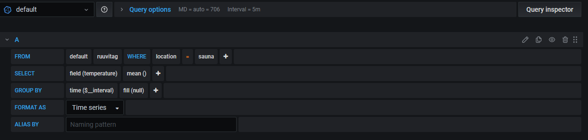

### Temperatue query example

### Adding alerts
For alert notifications first configure a notification channel. This is done from the main page under *Alerting*. For Telegram fill out the BOT API Token and the chat ID where you want the alerts to be sent.

Once you have the notification channel configured edit a panel to add the alarm. This is done from the Alert tab. There you can set the alarm rules.

### Node exporter
Set up the ready made [Node Exporter dashboard](https://grafana.com/oss/prometheus/exporters/node-exporter/)

Add a Datasource:
* Datasource select Prometheus
* URL: http://yourIP:9090/

Add the dashboard by going to Dashboards -> Manage and press the Import button. Enter the dashboard id: 13978, press load to import.