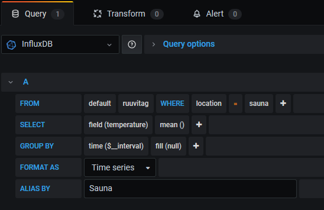

### Temperatue query example

### Adding alerts
For alert notifications first configure a notification channel. This is done from the main page under *Alerting*. For Telegram fill out the BOT API Token and the chat ID where you want the alerts to be sent.

Once you have the notification channel configured edit a panel to add the alarm. This is done from the Alert tab. There you can set the alarm rules.